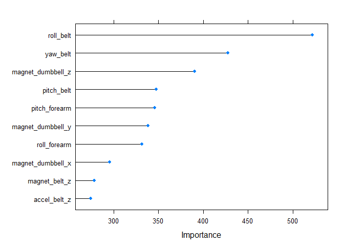

# Practical Machine Learning: Course Project
Ajit Nambissan  
22 July 2016  

#1.  Synopsis

Using devices such as Jawbone Up, Nike FuelBand, and Fitbit it is now possible to collect a large amount of data about personal activity 
relatively inexpensively. One thing that people regularly do is quantify how much of a particular activity they do, 
but they rarely quantify how well they do it. 

In this project, our goal will be to use data from accelerometers on the belt, forearm, arm, and dumbell of 6 participants 
and predict the manner in which they are performing the unilateral bicep curls. 

The 5 possible outcomes are that the curls are being performed:

    A: exactly according to the specification
    B: throwing the elbows to the front
    C: lifting the dumbbell only halfway
    D: lowering the dumbbell only halfway
    E: throwing the hips to the front

This report describes how the prediction model is built, how it is cross validated, evaluation of the expected out of sample error, 
and explaining the reasons of the choices made to build this model. The prediction model will then be used to predict 20 different 
test cases.

**The Data**

The training data for this project are available [here]( https://d396qusza40orc.cloudfront.net/predmachlearn/pml-training.csv )

The test data are available [here]( https://d396qusza40orc.cloudfront.net/predmachlearn/pml-testing.csv ).

The data for this project come from this source: http://groupware.les.inf.puc-rio.br/har. 

The training and testing data was downloaded and made available in the working directory.


#2. Data Processing

**Required Libraries**


```r
library(caret)
library(randomForest)
library(rpart)
```


##2.1   Loading the Data and clean up


```r
training <- read.csv(file="pml-training.csv", header=TRUE, na.strings=c("NA", "#DIV/0!",""))
testing <- read.csv(file="pml-testing.csv", header=TRUE, na.strings=c("NA", "#DIV/0!",""))
dim(training)
```

```
## [1] 19622   160
```

```r
dim(testing)
```

```
## [1]  20 160
```


**Remove columns that are not significant for this analysis**

There are many columns that have a high percentage of NA values and will not contribute much to our prediction model. Such columns are removed. 
For the same reasons, columns like raw_timestamp, new_window etc. are also removed.  

```r
training <- training[, colSums(is.na(training)) == 0]
testing <- testing[, colSums(is.na(testing)) == 0]

idxColsRemove <- grepl("^X|user_name|timestamp|window", names(training))
training <- training[, !idxColsRemove]

idxColsRemove <- grepl("^X|user_name|timestamp|window", names(testing))
testing <- testing[, !idxColsRemove]

dim(training)
```

```
## [1] 19622    53
```

```r
dim(testing)
```

```
## [1] 20 53
```


**Check for Non-Zero Variance**

Look for co-variates that have vear zero variance and remve them.


```r
 nsv <- nearZeroVar(training, saveMetrics = T)
 nsv
```

```
##                      freqRatio percentUnique zeroVar   nzv
## roll_belt             1.101904     6.7781062   FALSE FALSE
## pitch_belt            1.036082     9.3772296   FALSE FALSE
## yaw_belt              1.058480     9.9734991   FALSE FALSE
## total_accel_belt      1.063160     0.1477933   FALSE FALSE
## gyros_belt_x          1.058651     0.7134849   FALSE FALSE
## gyros_belt_y          1.144000     0.3516461   FALSE FALSE
## gyros_belt_z          1.066214     0.8612782   FALSE FALSE
## accel_belt_x          1.055412     0.8357966   FALSE FALSE
## accel_belt_y          1.113725     0.7287738   FALSE FALSE
## accel_belt_z          1.078767     1.5237998   FALSE FALSE
## magnet_belt_x         1.090141     1.6664968   FALSE FALSE
## magnet_belt_y         1.099688     1.5187035   FALSE FALSE
## magnet_belt_z         1.006369     2.3290184   FALSE FALSE
## roll_arm             52.338462    13.5256345   FALSE FALSE
## pitch_arm            87.256410    15.7323412   FALSE FALSE
## yaw_arm              33.029126    14.6570176   FALSE FALSE
## total_accel_arm       1.024526     0.3363572   FALSE FALSE
## gyros_arm_x           1.015504     3.2769341   FALSE FALSE
## gyros_arm_y           1.454369     1.9162165   FALSE FALSE
## gyros_arm_z           1.110687     1.2638875   FALSE FALSE
## accel_arm_x           1.017341     3.9598410   FALSE FALSE
## accel_arm_y           1.140187     2.7367241   FALSE FALSE
## accel_arm_z           1.128000     4.0362858   FALSE FALSE
## magnet_arm_x          1.000000     6.8239731   FALSE FALSE
## magnet_arm_y          1.056818     4.4439914   FALSE FALSE
## magnet_arm_z          1.036364     6.4468454   FALSE FALSE
## roll_dumbbell         1.022388    84.2065029   FALSE FALSE
## pitch_dumbbell        2.277372    81.7449801   FALSE FALSE
## yaw_dumbbell          1.132231    83.4828254   FALSE FALSE
## total_accel_dumbbell  1.072634     0.2191418   FALSE FALSE
## gyros_dumbbell_x      1.003268     1.2282132   FALSE FALSE
## gyros_dumbbell_y      1.264957     1.4167771   FALSE FALSE
## gyros_dumbbell_z      1.060100     1.0498420   FALSE FALSE
## accel_dumbbell_x      1.018018     2.1659362   FALSE FALSE
## accel_dumbbell_y      1.053061     2.3748853   FALSE FALSE
## accel_dumbbell_z      1.133333     2.0894914   FALSE FALSE
## magnet_dumbbell_x     1.098266     5.7486495   FALSE FALSE
## magnet_dumbbell_y     1.197740     4.3012945   FALSE FALSE
## magnet_dumbbell_z     1.020833     3.4451126   FALSE FALSE
## roll_forearm         11.589286    11.0895933   FALSE FALSE
## pitch_forearm        65.983051    14.8557741   FALSE FALSE
## yaw_forearm          15.322835    10.1467740   FALSE FALSE
## total_accel_forearm   1.128928     0.3567424   FALSE FALSE
## gyros_forearm_x       1.059273     1.5187035   FALSE FALSE
## gyros_forearm_y       1.036554     3.7763735   FALSE FALSE
## gyros_forearm_z       1.122917     1.5645704   FALSE FALSE
## accel_forearm_x       1.126437     4.0464784   FALSE FALSE
## accel_forearm_y       1.059406     5.1116094   FALSE FALSE
## accel_forearm_z       1.006250     2.9558659   FALSE FALSE
## magnet_forearm_x      1.012346     7.7667924   FALSE FALSE
## magnet_forearm_y      1.246914     9.5403119   FALSE FALSE
## magnet_forearm_z      1.000000     8.5771073   FALSE FALSE
## classe                1.469581     0.0254816   FALSE FALSE
```

Since the nsv for all columns is FALSE, there is no need to drop any more columns. 


##2.2  Partitioning the Training data

We have a training set containing 19622 observations and a testing set with 20 observations. 

Since we have a large number of training observations, the training data is partitioned into training and validation sets in 70-30 ratio.
The prediction model will be developed using the training set and the validation set will be used to provide feedback on how well the model fits the data.
This feedback will be used to improve the model, if necessary.


```r
set.seed(22072016)
trainingIdx <- createDataPartition(y=training$classe, p=0.7, list=FALSE)
trainingSet <- training[trainingIdx, ]
validationSet <- training[-trainingIdx, ]
dim(trainingSet)
```

```
## [1] 13737    53
```

```r
dim(validationSet)
```

```
## [1] 5885   53
```


#3. Building the Prediction Model


##3.1   Features Selected

These are the features selected for the modelling:


```r
result <- which(names(trainingSet) == "classe")
features <- names(trainingSet[,-result])

features
```

```
##  [1] "roll_belt"            "pitch_belt"           "yaw_belt"            
##  [4] "total_accel_belt"     "gyros_belt_x"         "gyros_belt_y"        
##  [7] "gyros_belt_z"         "accel_belt_x"         "accel_belt_y"        
## [10] "accel_belt_z"         "magnet_belt_x"        "magnet_belt_y"       
## [13] "magnet_belt_z"        "roll_arm"             "pitch_arm"           
## [16] "yaw_arm"              "total_accel_arm"      "gyros_arm_x"         
## [19] "gyros_arm_y"          "gyros_arm_z"          "accel_arm_x"         
## [22] "accel_arm_y"          "accel_arm_z"          "magnet_arm_x"        
## [25] "magnet_arm_y"         "magnet_arm_z"         "roll_dumbbell"       
## [28] "pitch_dumbbell"       "yaw_dumbbell"         "total_accel_dumbbell"
## [31] "gyros_dumbbell_x"     "gyros_dumbbell_y"     "gyros_dumbbell_z"    
## [34] "accel_dumbbell_x"     "accel_dumbbell_y"     "accel_dumbbell_z"    
## [37] "magnet_dumbbell_x"    "magnet_dumbbell_y"    "magnet_dumbbell_z"   
## [40] "roll_forearm"         "pitch_forearm"        "yaw_forearm"         
## [43] "total_accel_forearm"  "gyros_forearm_x"      "gyros_forearm_y"     
## [46] "gyros_forearm_z"      "accel_forearm_x"      "accel_forearm_y"     
## [49] "accel_forearm_z"      "magnet_forearm_x"     "magnet_forearm_y"    
## [52] "magnet_forearm_z"
```


##3.2   Training the Model

We will try building the model using three different modelling algorithms and select the one that produces the most accurate predictions 
for the validation set. This selected model will then be used to predict the outcomes for the 20 observations in the testing set.


```r
set.seed(1234)

mdlControl <- trainControl(method='cv', number = 3)

#CART model
mCART <- train(classe ~ ., data=trainingSet, method="rpart", trControl=mdlControl)
pCART <- predict(mCART, newdata=validationSet)
cmCART <- confusionMatrix(pCART, validationSet$classe)

#GBM model
mGBM <- train(classe ~ ., data=trainingSet, method="gbm", verbose=FALSE, trControl=mdlControl)
pGBM <- predict(mGBM, newdata=validationSet)
cmGBM <- confusionMatrix(pGBM, validationSet$classe)


#Random Forest Model
mRF <- train(classe ~ ., data=trainingSet, method="rf", trControl=mdlControl, ntree=100)
pRF <- predict(mRF, newdata=validationSet)
cmRF <- confusionMatrix(pRF, validationSet$classe)

modelCompare <- data.frame(cmCART$overall, cmGBM$overall, cmRF$overall)
print(modelCompare)
```

```
##                cmCART.overall cmGBM.overall cmRF.overall
## Accuracy         4.825828e-01     0.9655055    0.9935429
## Kappa            3.242465e-01     0.9563530    0.9918317
## AccuracyLower    4.697424e-01     0.9605213    0.9911478
## AccuracyUpper    4.954405e-01     0.9700211    0.9954266
## AccuracyNull     2.844520e-01     0.2844520    0.2844520
## AccuracyPValue  1.070134e-225     0.0000000    0.0000000
## McnemarPValue             NaN           NaN          NaN
```

Based on the above, the *Random Forest model* is selected since it is the most accurate. 

The confusion matrix for the selected model is as below:


```r
print(cmRF)
```

```
## Confusion Matrix and Statistics
## 
##           Reference
## Prediction    A    B    C    D    E
##          A 1674    4    0    0    0
##          B    0 1133    4    0    1
##          C    0    2 1019   19    0
##          D    0    0    3  943    3
##          E    0    0    0    2 1078
## 
## Overall Statistics
##                                           
##                Accuracy : 0.9935          
##                  95% CI : (0.9911, 0.9954)
##     No Information Rate : 0.2845          
##     P-Value [Acc > NIR] : < 2.2e-16       
##                                           
##                   Kappa : 0.9918          
##  Mcnemar's Test P-Value : NA              
## 
## Statistics by Class:
## 
##                      Class: A Class: B Class: C Class: D Class: E
## Sensitivity            1.0000   0.9947   0.9932   0.9782   0.9963
## Specificity            0.9991   0.9989   0.9957   0.9988   0.9996
## Pos Pred Value         0.9976   0.9956   0.9798   0.9937   0.9981
## Neg Pred Value         1.0000   0.9987   0.9986   0.9957   0.9992
## Prevalence             0.2845   0.1935   0.1743   0.1638   0.1839
## Detection Rate         0.2845   0.1925   0.1732   0.1602   0.1832
## Detection Prevalence   0.2851   0.1934   0.1767   0.1613   0.1835
## Balanced Accuracy      0.9995   0.9968   0.9944   0.9885   0.9979
```
The top 10 features of the selected model are:


```r
rfImp <- varImp(mRF, scale=FALSE)
plot(rfImp, top=10)
```

<!-- -->


#4. Prediction of testing outcome


```r
testPred <- predict(mRF, testing)
testPred
```

```
##  [1] B A B A A E D B A A B C B A E E A B B B
## Levels: A B C D E
```
